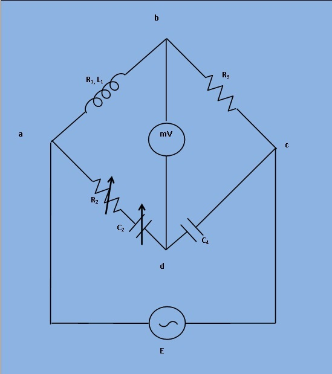

# Introduction
To determine the self-inductance of an unknown coil. 

## Theory

  

***Fig 1: Circuit Diagram for Measurement of Inductance by Owen's Bridge***

This bridge may be used for measurement of an inductance in terms of capacitance. Fig. 1. shows the connections for this bridge, under balance conditions.

Let,
  `L_1`= Unknown self Inductance of resistance `R_1`,

`R_2`= Variable non-inductive resistance,

`R_3`= Fixed non-inductive resistance,

`C_2`= Variable standard capacitor,

`C_4`= Fixed standard capacitor.

At balance condition, 

`(R_1 +jomegaL_1)*(1/(jomegaC_4)) = (R_2 + 1/(jomegaC_2))*R_3 ........(1)`

  

Equating both the real and imaginary parts in eq.`(1)` and seperating them,

`L_1 = R_2R_3C_4 ........(2)`

`R_1 = R_3*C_4/C_2 ........(3)`

The balance may be obtained by variation of resistance `R_2` and capacitor `C_2`.

