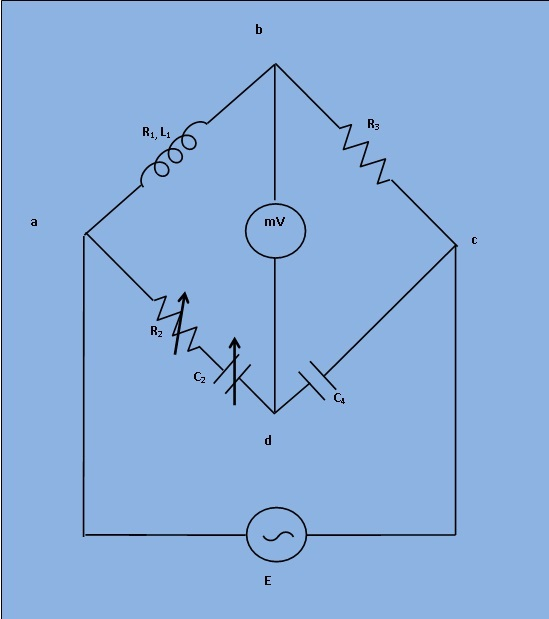

# Introduction
To determine the self-inductance of an unknown coil. 

## Theory

  

***Fig 1: Circuit Diagram for Measurement of Inductance by Owen's Bridge***

This bridge may be used for measurement of an inductance in terms of capacitance. Fig. 1. shows the connections for this bridge, under balance conditions.

Let,
  L1= Unknown self Inductance of resistance R1,

R2= Variable non-inductive resistance,

R3= Fixed non-inductive resistance,

C2= Variable standard capacitor,

C4= Fixed standard capacitor.

At balance condition,  

$$ (R_1 + j \omega L_1) * (\frac{1}{j \omega C_4}) = (R_2 + \frac {1}{j \omega C_2}) * R_3 ........(1) $$

 
Equating both the real and imaginary parts in eq.(1) and seperating them,

$$ L_1 = R_2R_3C_4 ........(2) $$

$$ R_1 = R_3* \frac{C_4}{C_2}  ........(3) $$

The balance may be obtained by variation of resistance R2 and capacitor C2.

